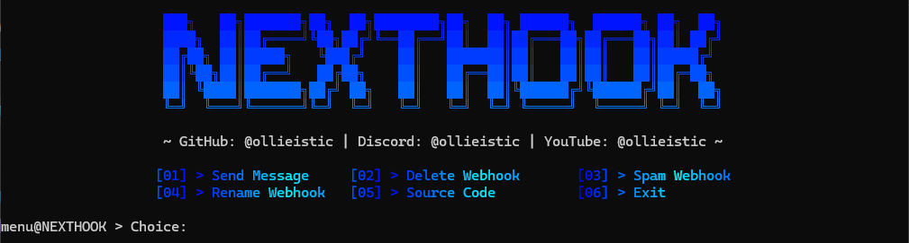

## 🤖 NextHook
NextHook is a Discord webhook multi-tool built in Python. Whether you are a server owner, administrator or just a casual user, with NextHook you can control your webhook(s) with ease. Enhance your webhook experience with NextHook today!

**Disclaimer: Certain features of NextHook can be used to harm other servers. Ollieistic, the author, will NOT be held responsible for any actions taken against you.**

## 🪟 Windows Setup
Here's a quick guide on how to setup NextHook on your Windows machine. It's easy, I promise.

1️⃣ Download the latest release of Python [here.](https://python.org/downloads)

2️⃣ Download the [program files.](https://github.com/ollieistic/NextHook/releases/latest)

3️⃣ Extract the program using any extracting software you'd like.

4️⃣ Navigate to the `setup` folder and run `install.bat` to install the required Python libraries.

5️⃣ Go back to the main folder and run `start.bat` to start NextHook!

If you need any support please join my Discord community: https://discord.gg/np4YQzbHcz

## 🐧 Linux Setup
Nexthook is not officially available on Linux. This will change soon, thank you for your patience.

## 📸 Preview (v1.1.1)

