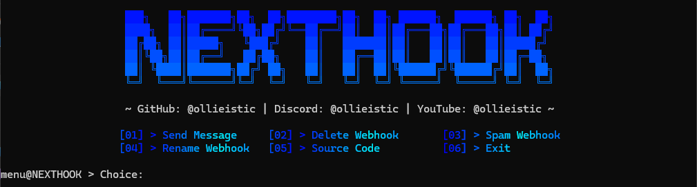

## 🤖 NextHook
NextHook is a Discord webhook multi-tool built in Python. Whether you are a server owner, administrator or just a casual user, with NextHook you can control your webhook(s) with ease. Enhance your webhook experience with NextHook today!

**Disclaimer: NextHook has features that can be used to harm servers. If you choose to harm other servers using NextHook, which is not recommended, you may face punishment I, the developer, will <u>NOT</u> be held responsible for any actions taken against you when using NextHook.**

If you need support, please join my [Discord community.](https://discord.gg/np4YQzbHcz)
## 🪟 Windows Setup
Here's a quick guide on how to setup NextHook on your Windows machine. It's easy, I promise.

1️⃣ Download the latest release of Python [here.](https://python.org/downloads)

2️⃣ Download the [program files.](https://github.com/ollieistic/NextHook/releases/latest)

3️⃣ Extract the program using any extracting software you'd like.

4️⃣ Navigate to the `setup` folder and run `install.bat` to install the required Python libraries.

5️⃣ Go back to the main folder and run `start.bat` to start NextHook!

## 🐧 Linux Setup
Nexthook hasn't been officially tested on Linux operating systems yet.

## 🔓 Open Source
NextHook is open-source because I want to contribute to the open-source community. I'm also too lazy to obfuscate my code, it would just get cracked anyways. If you want to use code from this project, you must follow the GNU GPL-v3 license. Here's a short summary of what you can do and cannot do:

- You are free to use, modify, and distribute this code as long as you provide proper attribution and use the same license.
- You are not allowed to use this code for commercial purposes (cannot sell).
- You are not allowed to remove the license from this code.
- You are not allowed to hold the author liable for any damages caused by this code.
- You are not allowed to use this code for illegal purposes.

## 📸 Preview
